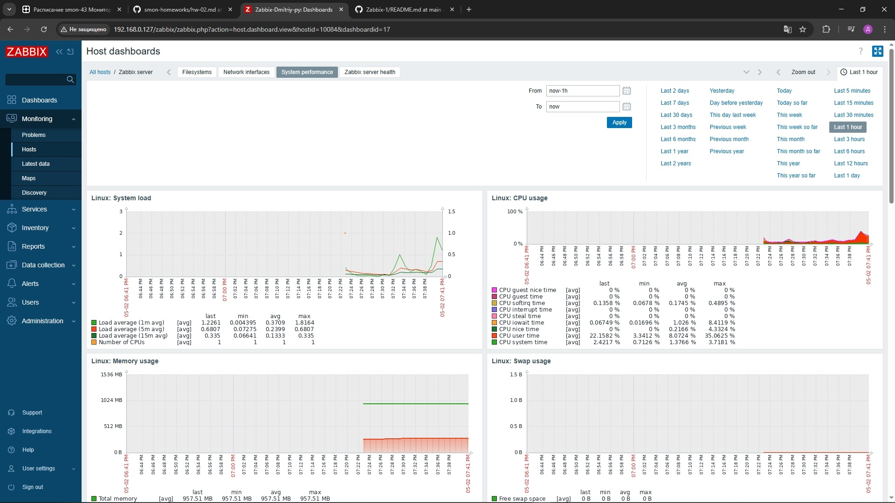

# Домашнее задание к занятию «Система мониторинга Zabbix»

# Петровский А.А

## Задание 1

Установите Zabbix Server с веб-интерфейсом.

Процесс выполнения
1. Выполняя ДЗ, сверяйтесь с процессом отражённым в записи лекции.
2. Установите PostgreSQL. Для установки достаточна та версия, что есть в системном репозитороии Debian 11.
3. Пользуясь конфигуратором команд с официального сайта, составьте набор команд для установки последней версии Zabbix с поддержкой PostgreSQL и Apache.
4. Выполните все необходимые команды для установки Zabbix Server и Zabbix Web Server.


## Ответ:

Vagrantfile:
 
```
# -*- mode: ruby -*-
# vi: set ft=ruby :

HOST_NAME = 'zabbix-test'
HOST_IP = '192.168.0.127'
HOST_USER = 'test'
HOST_USER_PASS = '123456789'
HOST_UPGRADE = 'true'
ZABBIX_DB_PASS = '1234567890'
HOST_SHOW_GUI = false
HOST_MEMMORY = "1024"
HOST_CPUS = 1
HOST_BRIDGE = "en0" # Замените на имя вашего сетевого адаптера
HOST_VM_BOX = "ubuntu/jammy64" # Ubuntu 22.04

# Используйте новый скрипт для Ubuntu
HOST_CONFIIG_SCRIPT = "zabbix-server-ubuntu.sh"

Vagrant.configure("2") do |config|
  config.vm.network "public_network", bridge: HOST_BRIDGE
  config.vm.box = HOST_VM_BOX
  config.vm.define HOST_NAME do |machine|
    machine.vm.network :public_network, ip: HOST_IP
    machine.vm.provider "virtualbox" do |current_vm|
      current_vm.name = HOST_NAME
      current_vm.gui = HOST_SHOW_GUI
      current_vm.memory = HOST_MEMMORY
      current_vm.cpus = HOST_CPUS
    end
  end
  config.vm.provision "shell", path: HOST_CONFIIG_SCRIPT, args: [HOST_USER, HOST_USER_PASS, ZABBIX_DB_PASS, HOST_UPGRADE]
end

```


zabbix-server-ubuntu.sh

```
#!/bin/bash
set -e

# Аргументы
USER=$1
PASS=$2
DB_PASS=$3
UPGRADE=$4

# Обновление системы
if [ "$UPGRADE" == "true" ]; then
  apt update -y
  apt dist-upgrade -y
fi

# Установка PostgreSQL
apt install postgresql -y

# Настройка репозитория Zabbix
wget https://repo.zabbix.com/zabbix/7.0/ubuntu/pool/main/z/zabbix-release/zabbix-release_7.0-1+ubuntu22.04_all.deb
dpkg -i zabbix-release_7.0-1+ubuntu22.04_all.deb
apt update -y

# Установка Zabbix server
apt install zabbix-server-pgsql zabbix-frontend-php php8.1-pgsql zabbix-apache-conf zabbix-sql-scripts apache2 -y

# Создание пользователя базы данных Zabbix
sudo -u postgres psql --command "CREATE USER zabbix WITH PASSWORD '$DB_PASS';"

# Создание базы данных Zabbix
sudo -u postgres psql --command "CREATE DATABASE zabbix OWNER zabbix;"

# Импорт схемы базы данных
zcat /usr/share/zabbix-sql-scripts/postgresql/server.sql.gz | sudo -u zabbix psql zabbix

# Настройка Zabbix server
sed -i "s/^DBPassword=.*/DBPassword=$DB_PASS/" /etc/zabbix/zabbix_server.conf

# Настройка временной зоны в PHP
sed -i "s/;date.timezone =.*/date.timezone = Europe\/Moscow/" /etc/php/8.1/apache2/php.ini

# Настройка веб-интерфейса
ln -s /etc/zabbix/apache.conf /etc/apache2/sites-available/zabbix.conf
a2ensite zabbix
apachectl configtest
echo "ServerName localhost" | sudo tee -a /etc/apache2/apache2.conf

# Перезапуск сервисов
systemctl restart apache2 zabbix-server
```

+ 


## Задание 2

Установите Zabbix Agent на два хоста.

Процесс выполнения
1. Выполняя ДЗ, сверяйтесь с процессом отражённым в записи лекции.
2. Установите Zabbix Agent на 2 вирт.машины, одной из них может быть ваш Zabbix Server.
3. Добавьте Zabbix Server в список разрешенных серверов ваших Zabbix Agentов.
4. Добавьте Zabbix Agentов в раздел Configuration > Hosts вашего Zabbix Servera.
5. Проверьте, что в разделе Latest Data начали появляться данные с добавленных агентов.


## Ответ:


Vagrantfile

```
Vagrant.configure("2") do |config|
  # Настройки для первой виртуальной машины (Zabbix agent 1)
  config.vm.define "zabbix-agent-1" do |agent1|
    agent1.vm.box = "ubuntu/jammy64"
    agent1.vm.hostname = "zabbix-agent-1"
    agent1.vm.network "public_network", bridge: "en0" # Замените en0 на ваш сетевой адаптер
    agent1.vm.network "public_network", ip: "192.168.0.128" # Установите статический IP-адрес
    agent1.vm.provision "shell", path: "zabbix-agent-ubuntu.sh", args: ["test", "123456789"] # Укажите путь к вашему скрипту установки Zabbix Agent
  end

  # Настройки для второй виртуальной машины (Zabbix agent 2)
  config.vm.define "zabbix-agent-2" do |agent2|
    agent2.vm.box = "ubuntu/jammy64"
    agent2.vm.hostname = "zabbix-agent-2"
    agent2.vm.network "public_network", bridge: "en0" # Замените en0 на ваш сетевой адаптер
    agent2.vm.network "public_network", ip: "192.168.0.129" # Установите статический IP-адрес
    agent2.vm.provision "shell", path: "zabbix-agent-ubuntu.sh", args: ["test", "123456789"] # Укажите путь к вашему скрипту установки Zabbix Agent
  end
end
```

zabbix-agent-ubuntu.sh

```
#!/bin/bash
set -e

# Аргументы
USER=$1
PASS=$2

# Обновление системы
apt update -y

# Установка Zabbix Agent
apt install zabbix-agent -y

# Настройка Zabbix Agent
# Получаем IP Zabbix Server из переменной окружения ZABBIX_SERVER_IP
ZABBIX_SERVER_IP="192.168.0.127" # Замените на статический IP вашего Zabbix Server

if [ -z "$ZABBIX_SERVER_IP" ]; then
  echo "Error: ZABBIX_SERVER_IP environment variable is not set."
  exit 1
fi

echo "Zabbix Server IP address is: $ZABBIX_SERVER_IP"
sed -i "s/Server=127.0.0.1/Server=$ZABBIX_SERVER_IP/" /etc/zabbix/zabbix_agentd.conf
sed -i "s/ServerActive=127.0.0.1/ServerActive=$ZABBIX_SERVER_IP/" /etc/zabbix/zabbix_agentd.conf
sed -i "s/Hostname=Zabbix agent/Hostname=$(hostname)/" /etc/zabbix/zabbix_agentd.conf

# Перезапуск Zabbix Agent
systemctl restart zabbix-agent
```

+ 

+ 

+ 

+ 

+ 

+ 

+ 

+ 

+ 

+ 

+ 

+ 

+ 
